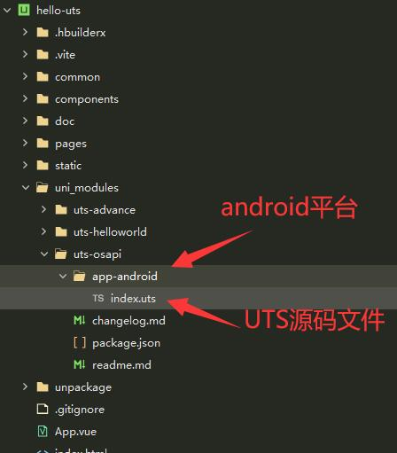

## 1 UTS原生插件介绍

### 1.1 什么是uts原生插件

UTS原生插件 是用UTS作为插件开发语言的一种新型插件形式。


### 1.2 uts原生插件与uni原生插件的区别

|-|传统原生插件|uts原生插件|
|-|-------|--------|
|开发语言|java/oc|uts|
|开发环境|Android studio/XCode|HBuilderX|
|打包方式|外挂aar 等产出物|编译时生成原生代码|

优点：

1  减少原生环境搭建环节，降低插件开发难度

2  进一步降低平台差异，一种语言开发两个平台插件

2  编译时生成原生代码，提高代码执行效率


## 2 创建UTS插件

### 2.1 UTS插件目录结构

首先确保项目根目录存在uni_modules文件夹


如果不存在，需要手动创建一个。

[关于uni_modules的详细说明](https://uniapp.dcloud.net.cn/plugin/uni_modules.html#%E4%BB%80%E4%B9%88%E6%98%AF-uni-modules)


### 2.2 新建步骤拆解

选中**uni_modules**目录 -- 右键 -- 新建插件


选择 **UTS原生插件**


UTS插件目录结构


### 2.3 清单文件package.json

package.json为插件的清单文件，这里集成了整个UTS插件的配置信息，下面是一个完整的示例
```
{
  "id": "uts-helloworld",
  "displayName": "UTS插件示例",
  "version": "0.1",
  "description": "UTS插件示例",
  "uni_modules": {
    "type": "uts",
    "uts": {
      "android": {
        "libs": [
          "xxx.aar"
        ],
        "dependencies": [{
          "id": "com.xxx.richtext:richtext",
          "source": "implementation 'com.xxx.richtext:richtext:3.0.7'"
        }],
        "minSdkVersion": 21
      },
      "ios": {
        "libs": [
          "xxx.a"
        ]
      },
      "dependencies": [
        "xxx.uts"
      ]
    }
  }
}
```


## 3 开发UTS原生插件

以android平台获取电量为例，介绍UTS原生插件开发步骤

第一步 在android平台目录下，编辑index.uts,键入以下内容




index.uts
```
// 引用android api
import Context from "android.content.Context";
import BatteryManager from "android.os.BatteryManager";
// 引用uts环境 api
import { getAppContext } from "io.dcloud.uts.android";

export function getBatteryCapacity(): string {
	// 获取android系统 application上下文
    const context = getAppContext();
    if (context != null) {
        const manager = context.getSystemService(
            Context.BATTERY_SERVICE
        ) as BatteryManager;
        const currentLevel: number = manager.getIntProperty(
            BatteryManager.BATTERY_PROPERTY_CAPACITY
        );
        return '' + currentLevel + '%';
    }
    return "0%";
}

```

保存时，触发自动编译。


至此，我们已经完成一个android平台上获取电量的原生能力封装。


在引用了此插件的项目中，我们可以像使用普通js函数一样，使用getBatteryCapacity函数来获取设备电量


## 4 使用插件

### 4.1 引用UTS插件

uts插件的引入 遵循ES6的import语法

下面介绍两种常见的引入方式


1 显性的引用

```
//引用
import {
  getBatteryCapacity,
} from "../../../uni_modules/uts-helloworld";

// 使用代码
getBatteryCapacity()
```
2 泛型引用

```
// 引用
import * as UTSHello from "../../../uni_modules/uts-helloworld";
// 使用代码
UTSHello.getBatteryCapacity()
```


## 5 测试

### 5.1 真机运行

UTS原生插件与运行调试没有差异，可以直接运行测试。

需要注意的是，如果是涉及自定义信息，需要选择自定义基座运行

### 5.2 云端打包


### 5.3 示例项目

完整的示例项目地址：


