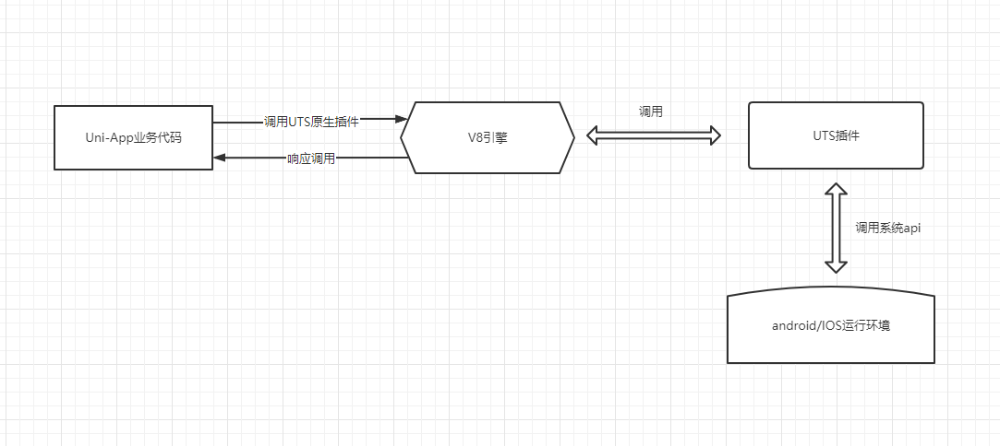
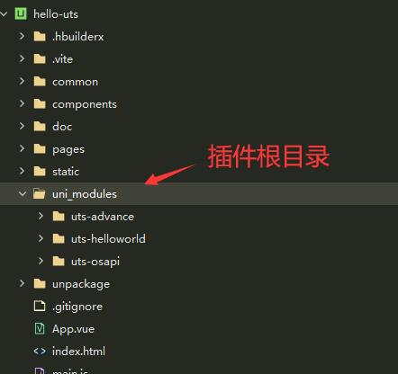
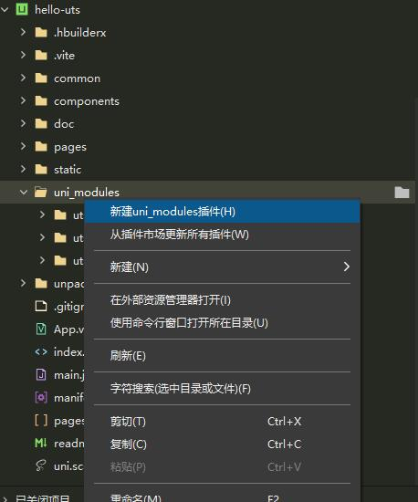
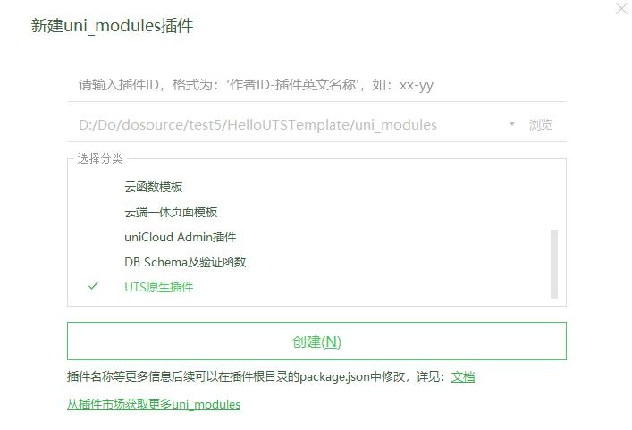
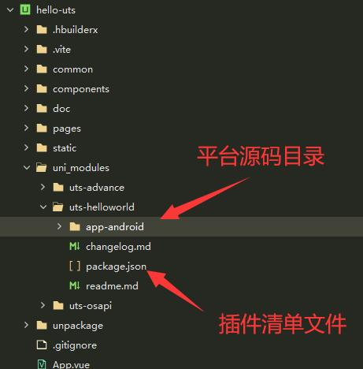

## 1 前置条件

+ 1 HX 3.5.6 之后版本

## 2 uts原生插件介绍

### 2.1 什么是uts原生插件

UTS= Uni Type Script.

UTS 插件是在uni原生插件的基础上，改用UTS作为插件开发语言。

进一步降低插件开发门槛，平台差异，执行效率的新型插件形式




### 2.2 uts原生插件与uni原生插件的区别

|-|传统原生插件|uts原生插件|
|-|-------|--------|
|开发语言|java/oc|uts|
|开发环境|Android studio/XCode|HBuilderX|
|打包方式|外挂aar 等产出物|编译时生成原生代码|

优点：

1  减少原生环境搭建环节，降低插件开发难度

2  进一步降低平台差异，一种语言开发两个平台插件

2  编译时生成原生代码，提高代码执行效率

## 3 UTS语法介绍


## 4 开发UTS插件

### 4.1  uni_modules

确保项目根目录存在uni_modules文件夹



`uni_modules`类似 NPM中的`node_modules`.是用来存放插件依赖的文件夹。

如果项目中已存在此目录，则跳过。如果不存在，在需要手动创建一个。


### 4.2 新建UTS插件

选中uni_modules文件夹 -->  右键新建插件



选择UTS原生插件



插件目录结构




### 4.3 清单文件package.json

package.json为插件的清单文件，里面说明了整个UTS插件的配置信息，下面是一个完整的示例
```
{
  "id": "uts-helloworld",
  "displayName": "uts-helloworld",
  "version": "1.0.0",
  "description": "uts-helloworld",
  "keywords": [
    "uts-helloworld"
],
  
  
}
```

## 5 使用插件

### 5.1 引用UTS插件

uts插件import有两种方式
import {a,b} from 'xxx'

```
import {
  callWithoutParam,
  callWithStringParam,
  callWithJSONParam
} from "../../../uni_modules/uts-helloworld";

```

import X from 'XXX'


### 5.2 用法

延迟操作
```
//执行延迟操作
var timer = setTimeout(function, 1000);
//取消延迟操作
clearTimeout(timer);
```
定时操作
```
//执行定时操作
var timer = setInterval(function, 1000);
//取消定时操作
clearInterval(timer);
```

## 6 测试

### 5.1 真机运行

直接运行

### 5.2 云端打包


### 5.3 示例项目

### 一个简单的示例
### 插件目录结构
### 插件使用方法

完整的示例项目地址：


